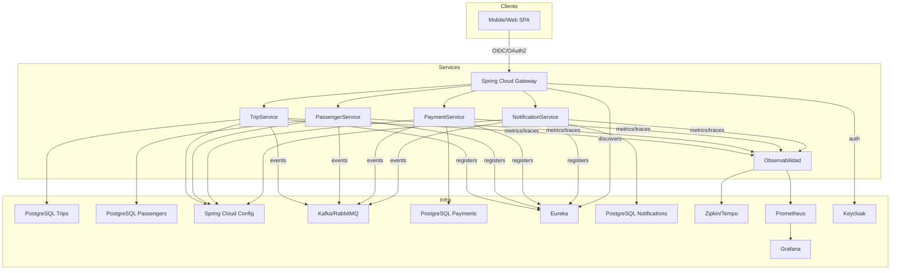
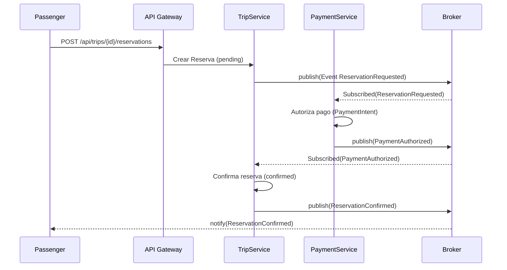
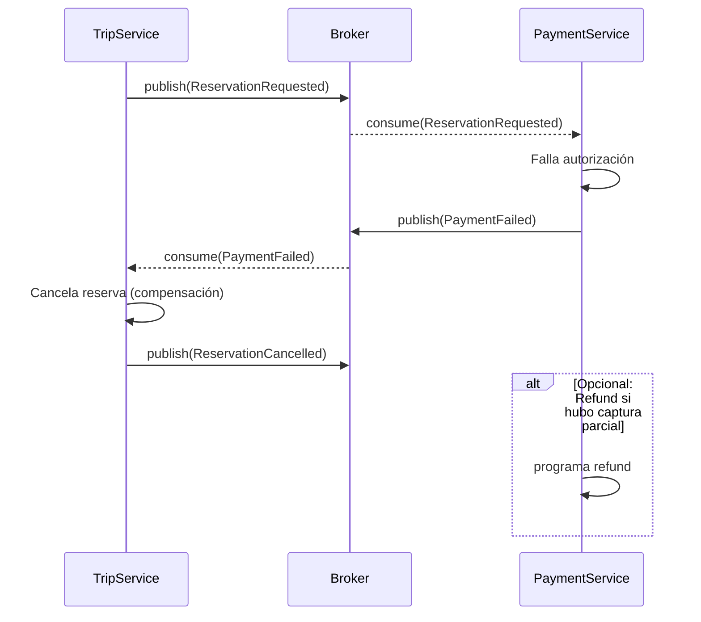

# ECO-RIDE LATAM: Carpooling corporativo para reducir costos de transporte

## Problema real
En muchas ciudades de LATAM, empleados que trabajan en la misma zona empresarial pagan transporte individual (bus, moto, taxi o apps) sin coordinación. Esto genera altos costos, tráfico y huella de carbono. La empresa Eco-Ride LATAM busca una solución de **carpooling corporativo**: conductores (empleados) publican rutas y asientos disponibles; pasajeros (empleados) reservan; el sistema cobra un monto simbólico por trayecto y coordina notificaciones. La solución debe ser **reactiva, segura y escalable**.

## Objetivos de aprendizaje
- Diseñar y desplegar **4 microservicios de negocio** con Spring Boot 3 + Spring Cloud.
- Implementar **API Gateway** (predicados, filtros nativos y filtros custom).
- Integrar **Keycloak (OAuth2/OIDC)** para autenticación/autorización.
- Aplicar el **patrón Saga** entre dos microservicios (reserva + pago) con eventos y compensaciones.
- Resilencia: **circuit breaker, retries**.
- Observar la plataforma: **tracing, métricas y logs correlacionados**.

## Alcance funcional (mínimo)
1.  **Publicación de viajes**: driver crea viaje recurrente o único; define origen/destino, horas, precio simbólico y asientos.
2.  **Descubrimiento y reserva**: pasajero busca viajes compatibles y reserva un asiento.
3.  **Pago**: autorización/captura de pago; en caso de falla, se cancela la reserva automáticamente via Saga.
4.  **Notificaciones**: email/SMS/push para confirmaciones, cancelaciones, recordatorios.
5.  **Perfiles**: conductores/pasajeros con historial, rating básico 1–5.

## Fuera de alcance (opcional)
- Geocoding/ETA en tiempo real; surge pricing; matching por proximidad dinámica.

## Microservicios de negocio (4)
1.  **TripService**
    - Domina `Trip` (viaje) y `Seat` (asiento). CRUD de viajes, listado por filtros, gestión de disponibilidad.
    - Publica/consume eventos: `ReservationRequested`, `ReservationConfirmed`, `ReservationCancelled`.
2.  **PassengerService**
    - Domina `Passenger`, `DriverProfile` y `Rating`. Gestión de perfil y reputación.
    - Emite `PassengerRated`, consume `TripCompleted` para habilitar rating.
3.  **PaymentService**
    - Domina `PaymentIntent`, `Charge`, `Refund`.
    - Implementa **Saga** con TripService: autoriza/captura pagos, o compensa (refund/cancel).
4.  **NotificationService**
    - Suscribe eventos de dominio y envía emails/SMS/push. Plantillas parametrizables.

## Identity & Access
Externalizado en **Keycloak** (Realm ecoride, clients: eco-gateway público, eco-internal confidencial). Roles: `ROLE_DRIVER`, `ROLE_PASSENGER`, `ROLE_ADMIN`.

## Arquitectura de referencia

## API Gateway
Implementar los filtros y predicados vistos en clases.

## Seguridad (Keycloak + OAuth2)
-   **Flujo SPA/Web**: Authorization Code + PKCE contra eco-gateway.
-   **Servicios internos**: client-credentials (eco-internal) para llamadas service-to-service via **TokenRelay** del Gateway.
-   **Scope-based**: `trips:read`, `trips:write`, `payments:charge`, `notifications:send`.
-   **Policies**: Sólo `ROLE_DRIVER` puede publicar viajes; `ROLE_PASSENGER` reserva; `ROLE_ADMIN` gestiona.

## Patrón Saga (reserva + pago)
Se requiere Saga entre TripService y PaymentService para el flujo de Reserva.

### Happy Path

### Compensación (falla de pago)

## Tipo de Saga
**Coreografía** con eventos en Kafka/RabbitMQ (recomendado para menor acoplamiento). Alternativa (opcional): **Orquestación** con un Saga Orchestrator ligero en PaymentService.

## Modelo de datos

### TripService
-   `trip(id, driver_id, origin, destination, start_time, seats_total, seats_available, price, status)`
-   `reservation(id, trip_id, passenger_id, status [pending|confirmed|cancelled], created_at)`

### PassengerService
-   `passenger(id, keycloak_sub, name, email, rating_avg, created_at)`
-   `driver_profile(id, passenger_id, license_no, car_plate, seats_offered, verification_status)`
-   `rating(id, trip_id, from_id, to_id, score, comment)`

### PaymentService
-   `payment_intent(id, reservation_id, amount, currency, status [requires_action|authorized|captured|failed])`
-   `charge(id, payment_intent_id, provider, provider_ref, captured_at)`
-   `refund(id, charge_id, amount, reason, created_at)`

### NotificationService
-   `template(id, code, channel[email|sms|push], subject, body)`
-   `outbox(id, event_type, payload, status[pending|sent|failed], retries)`

## Contratos de API (muestra mínima)

### TripService
-   `POST /trips` (ROLE_DRIVER)
-   `GET /trips?origin=&destination=&from=&to=` (ROLE_PASSENGER|DRIVER)
-   `POST /trips/{tripId}/reservations` (ROLE_PASSENGER) ⇒ `{reservationId}`
-   `GET /reservations/{id}`

### PassengerService
-   `GET /me` (recupera perfil por sub)
-   `POST /drivers/profile`
-   `POST /ratings` (post-trip)

### PaymentService
-   `POST /payments/intent` (internal) `{reservationId, amount}`
-   `POST /payments/capture/{intentId}` (internal)
-   `POST /payments/refund/{chargeId}` (internal)

### NotificationService
-   `POST /notify` (internal) `{templateCode, to, params}`

## Eventos
-   `ReservationRequested { reservationId, tripId, passengerId, amount }`
-   `PaymentAuthorized { reservationId, paymentIntentId, chargeId }`
-   `PaymentFailed { reservationId, reason }`
-   `ReservationConfirmed { reservationId }`
-   `ReservationCancelled { reservationId, reason }`
-   `TripCompleted { tripId }`

## Requisitos no funcionales
-   **Disponibilidad**: 99.5%.
-   **Latencia P95**: < 300 ms por solicitud sin I/O externo.
-   **Idempotencia**: reintentos seguros en Payment/Trip.
-   **Observabilidad**: trazas distribuidas (traceId/correlationId), métricas de negocio (reservations/s, success_rate), health checks.
-   **Seguridad**: RBAC por scopes y roles Keycloak. Pruebas de autorización negativas.

## Stack recomendado
-   **Spring Cloud**: Gateway, OpenFeign, Config, Eureka, Resilience4j, Sleuth/Micrometer.
-   **Mensajería**: Kafka (o RabbitMQ).
-   **DB**: PostgreSQL por servicio. Liquibase/Flyway para migraciones.
-   **Infra Dev**: Docker Compose con: Keycloak, Kafka, Postgres×4, Zipkin/Tempo, Prometheus, Grafana.
-   **Docs**: OpenAPI 3 por servicio (springdoc-openapi).

## Pruebas
-   **Unitarias**: JUnit5 + Mockito.
-   **Integración**: Testcontainers (Postgres, Kafka/RabbitMQ, Keycloak Testcontainer opcional).
-   **Contratos**: Spring Cloud Contract (Gateway ↔ Services).
-   **E2E feliz y compensación**: escenario completo de Saga (éxito y falla de pago).

## Entregables
1.  Repositorio `mono-repo` o `multi-repo` con 4 servicios + gateway + config.
2.  `docker-compose.yml` con dependencias.
3.  `curl` scripts.
4.  Diagramas Mermaid en README de arquitectura y sagas.
5.  Pipelines (GitHub Actions/GitLab CI) con build, tests y `docker build`. (OPCIONAL)
6.  Guía de despliegue local.

## Rúbrica de evaluación
-   Arquitectura y clean code (15%)
-   Seguridad (Keycloak, scopes, roles) (15%)
-   Gateway: predicados, filtros nativos y **almenos un filtro custom funcional** (15%)
-   Saga implementación + compensaciones (20%)
-   Observabilidad (tracing + métricas + logs) (10%)
-   Pruebas (unitarias, integración, e2e Saga) (15%)
-   Documentación (10%)

## Kickstart sugerido
-   Clonar `skeleton` (propio del equipo) con: `gateway/`, `trip-service/`, `passenger-service/`, `payment-service/`, `notification-service/`, `config/`, `deploy/`.
-   Inicializar Keycloak (realm, clients, roles) con `import JSON`.
-   Levantar dependencias: `docker compose up -d keycloak kafka postgres* zipkin prometheus grafana`.
-   Arrancar servicios con perfiles `dev` usando Config Server.
-   Probar flujo feliz: crear viaje → reservar → autorización → confirmación → notificación.
-   Probar compensación: simular `PaymentFailed` y verificar cancelación.

## Glosario breve
-   **Predicado**: condición de enrutamiento en el Gateway (p. ej., Path, Method, Host).
-   **Filtro**: transformación o *policy* en la ruta (p. ej., RewritePath, CircuitBreaker).
-   **Saga**: coordinación de transacciones distribuidas mediante una secuencia de pasos con compensaciones en caso de fallo.

## Entrega final
Demo en vivo ejecutando ambos escenarios (éxito y compensación), mostrando métricas/trazas en Grafana/Zipkin y roles/claims en tokens de Keycloak.
